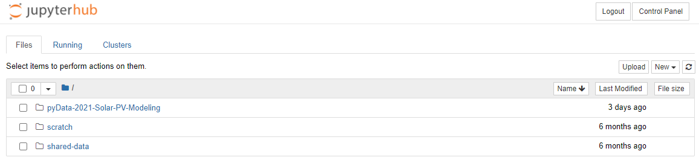
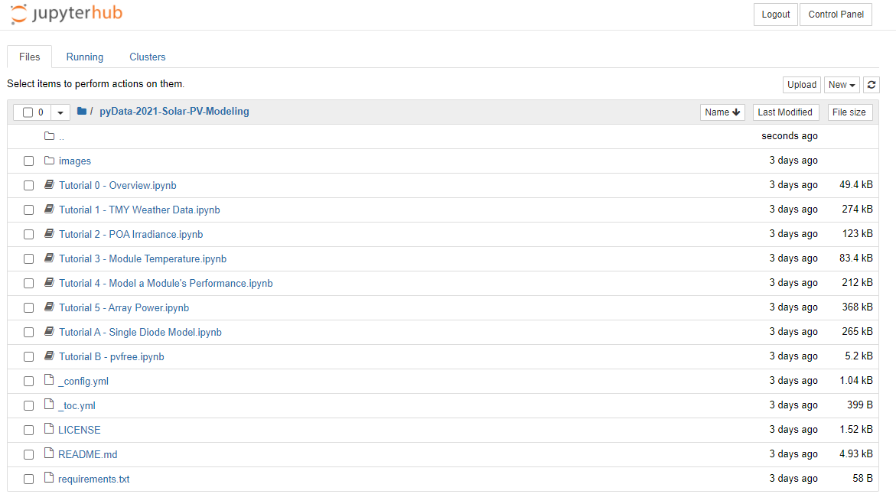

# pyData 2021 Global - Solar Modeling Tutorial
This tutorial focuses on PV computing packages, Python, data wrangling with Pandas, and data viz

## Tutorial Summary:
* **Tutorial 0**: Introduction to the tutorial, the lesson plan, and resources (~30 minutes)
* **Tutorial 1**: Access TMY weather data and visualize monthly irradiance data (~30 minutes)
* **Tutorial 2**: Calculate solar position, plane-of-array irradiance, and
  visualize average daily insolation (30 minutes)
* **Tutorial 3**: Estimate module temperature from ambient (~20 minutes)
* **Tutorial 4**: Use POA irradiance and module temperature to model output power
  from a single module (~20 minutes)
* **Tutorial 5**: Combine modules to form strings, calculate inverter efficiency
  and total array output (~independent study)
* **Tutorials Appendices**: More tutorials on a variety of fun topics (~independent study)

## Tutorial Setup
These tutorials are designed to run on [Jupyter](https://jupyter.org), a
browser based interactive notebook that allows you to run the tutorial in the
cloud without any additional setup. On the day of the tutorial, you can log
into the tutorial [here](https://pvsc-python-tutorial.eastus.cloudapp.azure.com/).

### THIS IS A 2-STEP PROCESS

- **STEP 1**: click [this](https://pvsc-python-tutorial.eastus.cloudapp.azure.com/) --> https://pvsc-python-tutorial.eastus.cloudapp.azure.com/
- **STEP 2**: click [this](https://pvsc-python-tutorial.eastus.cloudapp.azure.com/hub/user-redirect/git-pull?repo=https://github.com/PVSC-Python-Tutorials/pyData-2021-Solar-PV-Modeling&branch=main) --> https://pvsc-python-tutorial.eastus.cloudapp.azure.com//hub/user-redirect/git-pull?repo=https://github.com/PVSC-Python-Tutorials/pyData-2021-Solar-PV-Modeling&branch=main

The first time you visit the tutorial, you will need to create an account. Use
any username and password you like.


The first time you log into the tutorial, you will only see the scratch and shared-data folders.


After you log in, you need to download the tutorial from this GitHub repository by following this
[link (step 2)](https://pvsc-python-tutorial.ml/hub/user-redirect/git-pull?repo=https://github.com/PVSC-Python-Tutorials/pyData-2021-Solar-PV-Modeling&branch=main):

You only need to download the repository once, but you can always use either link to start the tutorial during the conference.
From now on you will see the pyData-2021-Solar-PV-Modeling tutorial folder in the list.



Click the folder to open, and you'll see the full list. Click `Tutorial 0 - Overview.ipynb` to get started.



Sometimes, if you are idle too long, the tutorial dies. Just click the [link to the tutorial](https://pvsc-python-tutorial.eastus.cloudapp.azure.com/) again to reconnect.

https://pvsc-python-tutorial.eastus.cloudapp.azure.com/

### Jupyter Book docs

The full tutorial is now also hosted as a beautiful [Jupyter book](https://jupyterbook.org/intro.html). This book has navigation, search, and can even run code cells interactively. Check it out!

https://pvsc-python-tutorials.github.io/pyData-2021-Solar-PV-Modeling/index.html

### My Binder

After the conference the tutorials will remain available here on GitHub, and you can run
the tutorial anytime in [Binder](https://mybinder.org) by clicking the
following link:

[](https://mybinder.org/v2/gh/PVSC-Python-Tutorials/pyData-2021-Solar-PV-Modeling/main)

### Locally

You can also run the tutorial locally with
[miniconda](https://docs.conda.io/en/latest/miniconda.html) by following thes
steps:

1. Install [miniconda](https://docs.conda.io/en/latest/miniconda.html).

1. Clone the repository:

   ```
   git clone https://github.com/PVSC-Python-Tutorials/pyData-2021-Solar-PV-Modeling.git
   ```

1. Create the environment and install the requirements. The repository includes
   a `requirements.txt` file that contains a list the packages needed to run
   this tutorial. To install them using conda run:

   ```
   conda create -n pvsc48 jupyter -c pvlib --file requirements.txt
   conda activate pvsc48
   ```

1. Start a Jupyter session:

   ```
   jupyter notebook
   ```

1. Use the file explorer in Jupyter lab to browse to `PVSC48-Python-Tutorial`
   and start the first Tutorial.


### Licensing

<a rel="license" href="http://creativecommons.org/licenses/by/4.0/"></a><br />This work is licensed under a <a rel="license" href="http://creativecommons.org/licenses/by/4.0/">Creative Commons Attribution 4.0 International License</a>.
